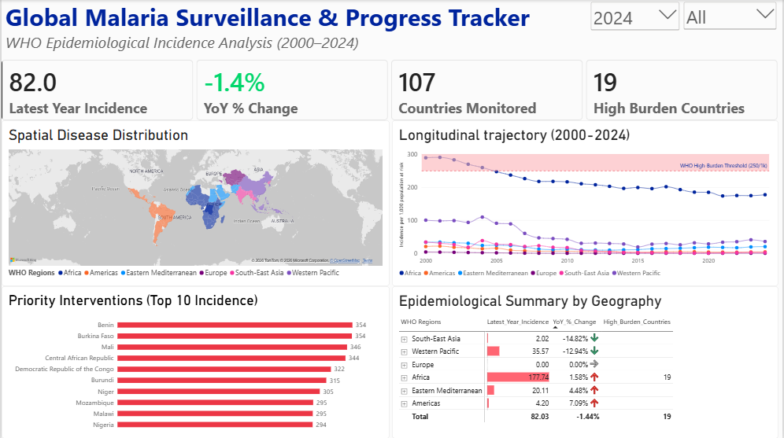

# Global Malaria Surveillance Dashboard (2000–2024)

A Power BI dashboard built using UN/WHO epidemiological data to track global malaria incidence trends, regional disease burden, and high-priority zones.

## Dashboard Overview

---

## Key Features & Analytics

- **Core KPIs:** Tracks global incidence rate per 1,000 at risk, YoY % change, and countries exceeding the WHO 250/1k high-burden threshold.
- **Interactive Visuals:** Includes a Bing Spatial Map, 20-year trend line chart, Top 10 High-Burden country ranking, and an expandable Regional Matrix.
- **Power Query ETL:** Raw WHO data cleaned, unpivoted, and structured natively in Power Query.
- **DAX Time-Intelligence:** Dynamic measures created for YoY % change and conditional visual formatting.

---

## Project Files

- `dataset/`: Contains the raw WHO Global Health Observatory CSV.
- `dashboard/`: Contains the complete `.pbix` Power BI report file.
- `assets/`: Contains dashboard screenshot previews.
